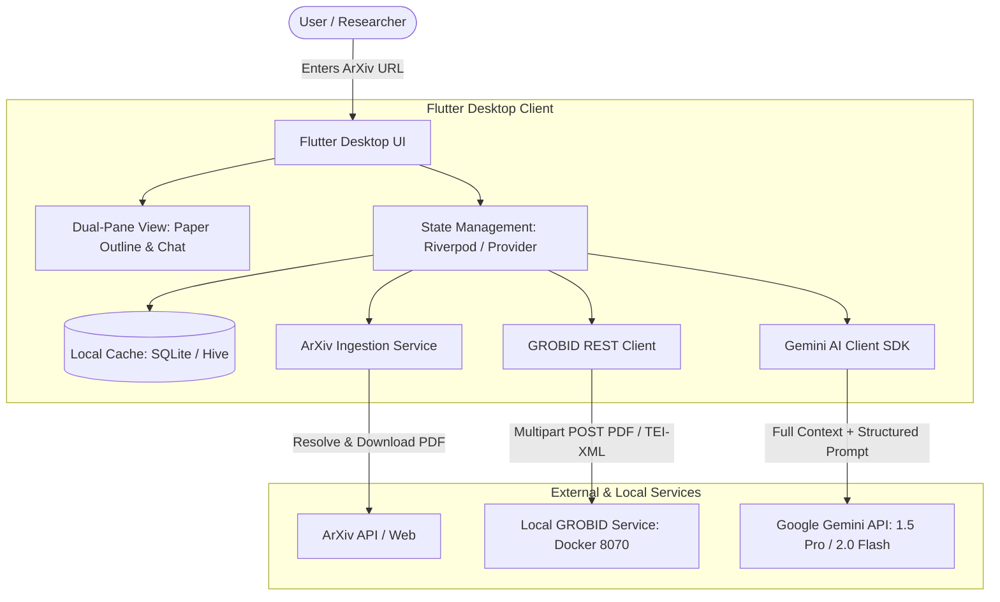
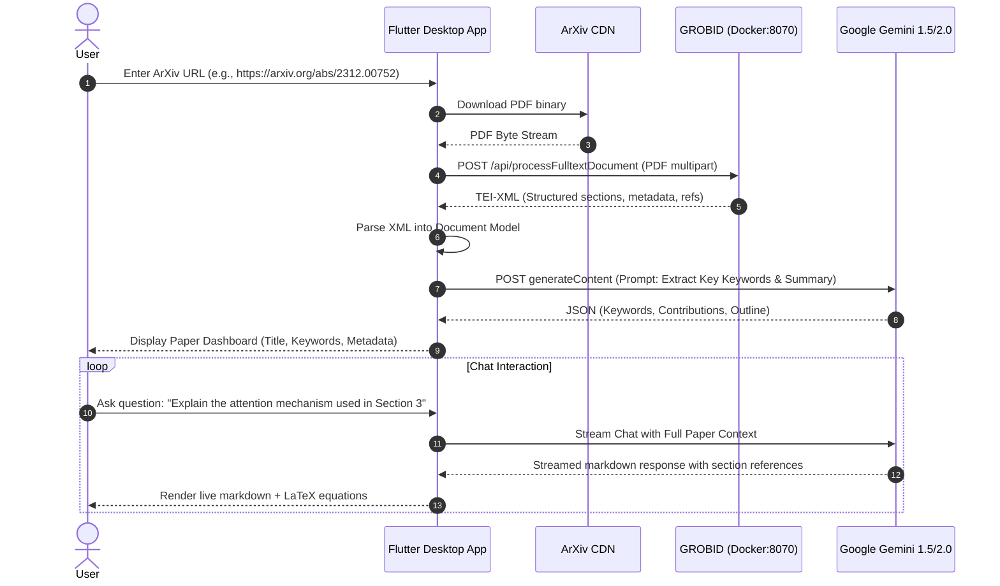

# PaperChat AI — Desktop Application Specification
**Topic**: Academic Research Paper Chat with AI & GROBID Integration  
**Target Platform**: Desktop (Flutter — Windows / macOS / Linux)  
**Primary AI Engine**: Google Gemini 1.5 Pro / 2.0 Flash (1M–2M Token Context Window)  
**Document Processing Engine**: GROBID (GeneRation Of BIbliographic Data via Docker)  

---

## 1. Executive Summary

**PaperChat AI** is a high-performance desktop application designed for researchers, academics, and students. The application allows users to input research paper links (primarily ArXiv URLs), automatically processes and extracts structured bibliographic and full-text data using a local **GROBID** server, extracts core keywords and contributions, and facilitates an interactive, highly intelligent question-and-answer dialogue via **Google Gemini** (Gemini 1.5 Pro / 2.0 Flash).

By combining GROBID's structural parsing with Gemini's massive context window, the application achieves zero-loss paper ingestion without the typical fragmentation and context degradation of basic RAG (Retrieval-Augmented Generation) pipelines.

---

## 2. System Architecture

The application is structured into four distinct layers:



### 2.1 Layer Breakdown

1. **Presentation Layer (Flutter Desktop)**:
   - Clean, academic-focused modern UI with dark/light theme support.
   - Dual-pane layout: Document tree/metadata on the left, interactive chat and keyword inspector on the right.
   - Native Markdown rendering (`flutter_markdown`) and LaTeX mathematical formula rendering (`flutter_math_fork`).

2. **Ingestion & Processing Layer**:
   - **ArXiv Resolver**: Converts abstract URLs (e.g., `https://arxiv.org/abs/2401.12345`) into raw PDF endpoints (`https://arxiv.org/pdf/2401.12345.pdf`).
   - **PDF Downloader**: Streams PDF with progress indicator into local app cache.
   - **GROBID Client**: Communicates with the local Dockerized GROBID container via HTTP REST (`/api/processFulltextDocument`).
   - **TEI-XML Parser**: Parses hierarchical sections, headers, abstracts, citations, tables, and references into structured Dart domain models.

3. **AI Reasoning & Analysis Layer**:
   - **Google Gemini API**: Utilizes Gemini 1.5 Pro / 2.0 Flash. With up to 2,000,000 tokens of context, the entire parsed text, structural outline, and references can be fed directly to the model.
   - **Automatic Synthesizer**: Automatically extracts the paper's core contributions, key methodologies, and domain-specific keywords upon ingestion.
   - **Section-Grounded Chat**: Facilitates deep conversational queries, enabling users to ask for explanations, formula derivations, methodology critique, and related works.

4. **Persistence Layer**:
   - Caches parsed papers, TEI structure, extracted metadata, and conversation histories in local storage (SQLite/Hive) so previously parsed papers can be revisited offline.

---

## 3. Functional Requirements (FR)

### FR-1: ArXiv Paper Ingestion
- **FR-1.1**: The system must validate and accept ArXiv URLs in both abstract format (`https://arxiv.org/abs/{id}`) and PDF format (`https://arxiv.org/pdf/{id}(.pdf)`).
- **FR-1.2**: The system must resolve ArXiv IDs and fetch the corresponding PDF binary asynchronously, displaying download progress in the UI.
- **FR-1.3**: The system must store downloaded PDFs in an application-managed local cache directory.

### FR-2: GROBID Structural Extraction
- **FR-2.1**: The system must connect to a local GROBID instance running via Docker (default: `http://localhost:8070`).
- **FR-2.2**: The system must provide a connection status indicator (Online / Offline / Processing) with guidance to start the Docker container if offline.
- **FR-2.3**: The system must send the PDF binary to GROBID's `/api/processFulltextDocument` endpoint using `multipart/form-data`.
- **FR-2.4**: The system must parse the returned TEI-XML (Text Encoding Initiative) into domain objects:
  - **Metadata**: Title, Authors, Affiliations, Publication Year, Abstract.
  - **Document Structure**: Section headings, paragraphs, equation tags, figure captions.
  - **Bibliographic References**: Citations, authors, publication years, source venues.

### FR-3: Automated Key Insight & Keyword Extraction
- **FR-3.1**: Upon receiving the parsed document, the application automatically dispatches a synthesis request to the Gemini model.
- **FR-3.2**: The model returns a structured JSON payload containing:
  - **Executive Summary**: 3–5 bullet points summarizing the paper's novel contributions.
  - **Primary Keywords**: 5–10 authoritative keywords categorized by Topic, Method, and Dataset/Benchmark.
  - **Problem Statement & Proposed Solution**: Concise 2-paragraph overview.
- **FR-3.3**: The UI displays these keywords as clickable interactive chips; clicking a chip triggers an automatic query to Gemini to explain how this concept is specifically applied in the paper.

### FR-4: Conversational Chat with AI
- **FR-4.1**: Users can interact through a conversational chat interface with real-time text streaming.
- **FR-4.2**: The chat prompt incorporates the paper's full parsed content and document structure within Gemini's context window.
- **FR-4.3**: Gemini is instructed to provide grounded responses with section citations (e.g., `[Section 3.2: Methodology]`).
- **FR-4.4**: The chat view supports rich Markdown, code blocks with syntax highlighting, and LaTeX mathematical expressions (e.g., $\mathcal{L}_{total} = \lambda_1 \mathcal{L}_{recon} + \lambda_2 \mathcal{L}_{kl}$).
- **FR-4.5**: Suggested starter questions are auto-generated based on the paper type (e.g., *"What is the main limitation of this approach?"*, *"How does this baseline compare against SOTA?"*).

### FR-5: Paper Library & Chat History
- **FR-5.1**: Users can view previously ingested papers in a sidebar library.
- **FR-5.2**: Chat sessions are persisted per paper; switching between papers loads corresponding conversation histories.
- **FR-5.3**: Users can clear chat history or export conversations as Markdown files.

### FR-6: Application Settings & Configuration
- **FR-6.1**: Secure storage for the Google Gemini API Key (stored in encrypted storage / SharedPreferences).
- **FR-6.2**: Configurable GROBID endpoint URL (defaults to `http://localhost:8070` with test-connection feature).
- **FR-6.3**: Model selector option: `gemini-2.0-flash` (fast, cost-efficient) or `gemini-1.5-pro` (maximum reasoning depth).

---

## 4. Non-Functional Requirements (NFR)

- **NFR-1 (Performance)**: UI interactions must remain responsive at 60+ FPS on desktop; all heavy networking and file I/O operations must be executed in asynchronous background tasks / Dart isolates.
- **NFR-2 (Fault Tolerance & Resilience)**: If the local GROBID server is unavailable or fails to parse a specific PDF, the system must offer a fallback to direct Gemini PDF-ingestion (using Gemini's native multimodal document processing capabilities).
- **NFR-3 (Context Window Reliability)**: Leveraging Gemini's 1M+ token limit avoids chunking and sliding-window retrieval hallucinations, ensuring 100% full-document recall.
- **NFR-4 (Security & Privacy)**: API keys and paper files remain strictly on the user's local machine; only the explicit user prompts and paper content are transmitted to the secure Google Gemini API endpoint over HTTPS.

---

## 5. Technology Stack & Key Dependencies

| Component | Technology | Purpose |
| :--- | :--- | :--- |
| **Framework** | Flutter Desktop (Dart) | Cross-platform desktop application (Windows, macOS, Linux) |
| **State Management** | `flutter_riverpod` or `provider` | Reactive state management and dependency injection |
| **HTTP & Networking** | `dio` / `http` | Multipart file upload to GROBID and API calls |
| **XML Parsing** | `xml: ^6.5.0` | Parsing GROBID TEI-XML output into structured Dart models |
| **LLM Integration** | `google_generative_ai` | Official Google Gemini Dart SDK (Streaming, Chat Session) |
| **Markdown & Math** | `flutter_markdown`, `flutter_math_fork` | Rendering formatted responses, code, and LaTeX math |
| **Local Storage** | `sqflite_common_ffi` or `hive` | Local desktop SQLite database for paper and chat persistence |
| **Secure Storage** | `flutter_secure_storage` | Securely storing the Gemini API key |
| **Document Parser** | `grobid/grobid:0.8.1` (Docker) | State-of-the-art machine-learning parser for scientific documents |

---

## 6. GROBID Docker Deployment Specification

To enable GROBID parsing on the user's desktop machine:

### 6.1 Docker Run Command
```bash
docker run -t --rm --init -p 8070:8070 grobid/grobid:0.8.1
```

### 6.2 Healthcheck & API Endpoints
- **Healthcheck**: `GET http://localhost:8070/api/isalive` -> Returns `true`
- **Full-Text Parsing**: `POST http://localhost:8070/api/processFulltextDocument`
  - Form field: `input` (Binary PDF file)
  - Returns: TEI-XML document string

---

## 7. Data Flow & Processing Pipeline



---

## 8. Gemini Prompt Engineering Strategy

### 8.1 Keyword & Executive Summary Extraction Prompt
```text
System Instructions:
You are an expert scientific researcher and peer reviewer. 
You will be provided with the structured text and metadata of a scientific paper parsed via GROBID.

Analyze the document and provide output strictly in JSON format with the following keys:
{
  "title": "Paper title",
  "summary": "Concise 3-paragraph summary covering problem, methodology, and outcome",
  "key_contributions": ["Contribution 1", "Contribution 2", "Contribution 3"],
  "primary_keywords": [
    {"term": "Keyword 1", "category": "Methodology", "context": "Brief explanation in paper"},
    {"term": "Keyword 2", "category": "Domain/Task", "context": "Brief explanation in paper"}
  ],
  "suggested_questions": [
    "Question 1 to ask about the methodology",
    "Question 2 to ask about the results",
    "Question 3 to ask about future directions"
  ]
}
```

### 8.2 Conversational Chat Prompt
```text
System Instructions:
You are PaperChat AI, an academic assistant analyzing the following research paper:
[TITLE]: {{paper_title}}
[AUTHORS]: {{paper_authors}}
[SECTIONS]:
{{structured_sections_text}}

Instructions:
1. Always ground your answers in the provided paper content.
2. Cite the specific section number or title whenever discussing methodology, theorems, or experimental results (e.g. "[Section 4.1]").
3. Render mathematical formulas in standard LaTeX using $ for inline math and $$ for display math.
4. If the user asks about something not mentioned in the paper, clarify that it is not covered in this document.
```

---

## 9. Implementation Roadmap

- [ ] **Phase 1: Project Setup & Docker Environment**
  - Initialize Flutter Desktop project structure.
  - Setup and verify local GROBID Docker container (`grobid/grobid:0.8.1`).
  - Configure dependencies in `pubspec.yaml`.

- [ ] **Phase 2: Ingestion & GROBID Integration**
  - Implement `ArxivService` to parse abstract URLs and download PDFs.
  - Implement `GrobidService` to post PDFs to `/api/processFulltextDocument`.
  - Implement `TeiXmlParser` using Dart's `xml` package to extract structured sections.

- [ ] **Phase 3: Gemini AI Integration**
  - Integrate `google_generative_ai` SDK with Gemini 2.0 Flash / 1.5 Pro.
  - Implement automated keyword and executive summary extraction.
  - Implement real-time streaming conversational chat session with context retention.

- [ ] **Phase 4: Desktop UI Development**
  - Design modern split-view interface (Paper Details & Outline on Left; Chat & Keywords on Right).
  - Implement interactive keyword chips and suggested starter questions.
  - Add Markdown and LaTeX mathematical formula rendering support.

- [ ] **Phase 5: Local Persistence & Settings**
  - Implement local library caching using SQLite/Hive.
  - Build Settings view for Gemini API key and GROBID endpoint configuration.
  - Add end-to-end error handling and fallback mechanisms.
